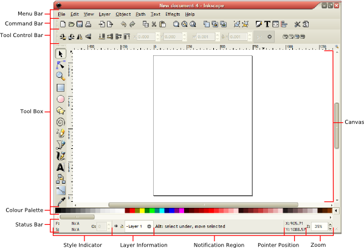

# Making beautiful scientific graphics using Inkscape

Inkscape is a cross-platform graphical editor for Scalable Vector Graphics (SVG) files.
There is a lot of great Inkscape documentation out there, and the [Basic Tutorial](https://inkscape.org/en/doc/basic/tutorial-basic.html) is a good place to start.
Here are some essentials.

## A few notes about SVGs
* SVG is a file format you can open in modern browsers.
* It is a vector format, which means you don't lose resolution when you zoom in, in contrast to bitmap (a.k.a. pixel) formats such as PNG or JPG.
* It is text-based format.
* Your plotting program may make SVG. If it doesn't, then perhaps it makes EPS or PDF files, which can be imported by Inkscape.

## Overall layout of an Inkscape session

You can read more [here](http://en.flossmanuals.net/inkscape/introduction/the-inkscape-interface/), but just remember the location of the *Tool Control Bar*.
It changes depending on what tool is being used.

## Moving around in your document
* The magnifying glass enables zooming with a click or a rectangle selection. Shift-click zooms out.
* View menu has lots of options for zooming. Pressing `5` zooms to frame your document.
* Zoom in and out using Control and scroll wheel.
* Ctrl-arrows move your view of the document around.

## Selecting objects
* Make sure you are using the "Select and transform objects" tool (on the top)
* Click to select an object.
* Shift-click (i.e. click while holding down Shift) to add an object to the selection.
* Click and drag to select objects in a box.
* Esc deselects everything.
* Tab selects the next object. Shift-tab selects the previous object.

## Modifying objects
* Copy-paste and duplicate work as you might expect.
* Move your selection by dragging. Control-drag only moves in one direction.
* Or move your selection using the arrow keys. Alt-arrow moves items a small amount.
* Stretch using arrows around object. Hold the Control key to keep aspect ratio.
* Click objects again to be able to rotate and skew them.
* Objects have an order of what is on top of what, and you can change that using buttons in the Selection Tool Control Bar.
* There is a button on the right of the Tool Control Bar to determine if stretching an object changes line thickness or not.
* If you mess something up, you have infinite undo!

## Shapes
* Circles: Tool Control Bar can give you partial circles.
* Squares: Tool Control Bar can give you rounded edges.
* Stars and polygons are nice. Squiggles??
* You can add bitmap images.

## Making paths
* To make a simple line, click left to set a start point, then click left again to set the end point. You can continue to add segments to your path by left clicking, then click right to end.
* To make a closed path, just make your last click at the start point.
* To make a Bezier curve, click and drag with left, release when you have the length right, then move the mouse and click left to finalize line.
As before, you can continue adding segments to your path until you click right.
* To make a more complex curve, you can use the pencil tool with simplification.
* To make an area, bound it with objects and then use the paint dump tool.
* Tracing a bitmap is a great way to cheat!

## Modifying paths
* Add and delete control nodes. Change from a smooth node to a corner node and back.
* Simplify a path with Control-L.
* Do not be afraid!

## Fill and stroke
* Change object properties with Fill and Stroke, such as stroke width and other line characteristics.
* Make ends meet pleasantly by using butt ends for your lines.
* Arrowheads can be added as Markers.

## Colors
* Click to select fill color from little boxes, shift-click to select stroke color.
* Can have finer grained control using fill and stroke dialog (suggestion: use HSL, not RGB!)
* Use color dropper to change color using an existing color.
* To look super pro, use Colorbrewer colors.
* To look even pro-er, use gradients.

## Alignment
* Control-shift-A, and try options.
* Note the "Relative to" menu!
* Aligning text is different than lining up objects: use the special text alignment buttons.

## Groups
* Group with Control-G.
* Ungroup with Control-U.
* Group things to ensure consistent resizing and rotating across several objects.
* You can group groups, etc!

## Text
* Text is self-explanatory, except that clicking and dragging the text tool will make a nice text box that does line wrapping.
* Setting the default font in "Text and Font" menu item is very handy.

## Document
* Resize your document using document properties (Control-Shift-D).
* You can use the same dialog to export your document to a bitmap format.
* If you want to make sure that your document looks good on others' computers, you could consider converting text to paths.

<!--
## Advanced techniques:
* finding something by color
* Edit > Select Same > Fill Color
-->
